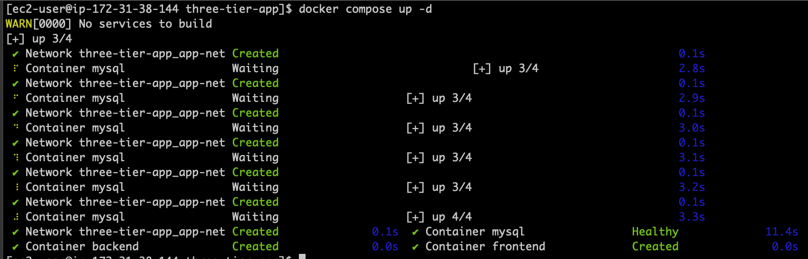

# Production-Grade Three-Tier Application (Docker & Docker Compose)

A real-world **production-style three-tier application** built using **Docker and Docker Compose**, demonstrating containerized frontend, backend, and database services with proper networking, health checks, persistence, and startup resilience.

## ScreenShots
 <br>
---------------------------------------------------

## 🏗️ Architecture Overview

```bash 

Client (Browser)
|
v
+-------------+
| Nginx | ← Frontend (Reverse Proxy + Static UI)
+-------------+
|
v
+-------------+
| Node.js | ← Backend API
+-------------+
|
v
+-------------+
| MySQL | ← Database (Persistent Volume)
+-------------+


## 📦 Tech Stack

| Layer      | Technology |
|-----------|------------|
| Frontend  | Nginx (Alpine) |
| Backend   | Node.js 20 (Express) |
| Database  | MySQL 8.0 |
| Runtime   | Docker |
| Orchestration | Docker Compose |
| Storage   | Docker Named Volumes |

---

## 📁 Project Structure

three-tier-app/
├── docker-compose.yml
├── .env
├── frontend/
│ ├── index.html
│ └── nginx.conf
├── backend/
│ ├── app.js
│ ├── package.json
│ └── Dockerfile
└── db/
└── init.sql

## ⚙️ Key Features & Best Practices

- ✅ **Three-tier architecture**
- ✅ **Reverse proxy with Nginx**
- ✅ **Health checks for services**
- ✅ **Persistent MySQL storage using Docker volumes**
- ✅ **Environment-based configuration**
- ✅ **Database connection retry logic**
- ✅ **Non-root container execution**
- ✅ **Docker Compose v2 compatible**
- ✅ **Production-ready logging & networking**


## 🚀 Getting Started


🔧 Prerequisites (Amazon Linux 2023)

This project was tested on Amazon Linux 2023.
Follow the steps below to install Docker, Docker Compose v2, and Docker Buildx.

1️⃣ Update the system
sudo dnf update -y

2️⃣ Install Docker Engine
sudo dnf install docker -y


Start and enable Docker:

sudo systemctl start docker
sudo systemctl enable docker


Verify:

docker --version

3️⃣ Allow non-root Docker usage (recommended)
sudo usermod -aG docker ec2-user
newgrp docker


Verify:

docker ps

4️⃣ Install Docker Compose v2 (Plugin)

Amazon Linux 2023 does not install Compose by default.

mkdir -p ~/.docker/cli-plugins


Download Compose:

curl -SL https://github.com/docker/compose/releases/download/v2.27.0/docker-compose-linux-x86_64 \
  -o ~/.docker/cli-plugins/docker-compose


Make executable:

chmod +x ~/.docker/cli-plugins/docker-compose


Verify:

docker compose version

5️⃣ Install Docker Buildx (Required for build:)

Docker Compose v2 uses Buildx for image builds.

curl -SL https://github.com/docker/buildx/releases/download/v0.17.1/buildx-v0.17.1.linux-amd64 \
  -o ~/.docker/cli-plugins/docker-buildx

chmod +x ~/.docker/cli-plugins/docker-buildx


Verify:

docker buildx version

6️⃣ Initialize Buildx Builder
docker buildx create --use
docker buildx inspect --bootstrap


This will create a BuildKit container internally.

### 1️⃣ Clone the Repository

git clone https://github.com/<your-username>/three-tier-docker-app.git
cd three-tier-docker-app
2️⃣ Configure Environment Variables

Create .env file:(Not committed due to secrets.)

MYSQL_ROOT_PASSWORD=yourpassword
MYSQL_DATABASE=appdb

DB_HOST=mysql
DB_USER=root
DB_PASSWORD=yourpassword
DB_NAME=appdb


3️⃣ Build Backend Image Manually (if not using buildx)
cd backend
docker build -t three-tier-app-backend .
cd ..

## Then change the build to image under backend container in docker.compose.yml -  image: yourimagename

4️⃣ Start the Stack
docker compose up -d

🔍 Verify Services
Check running containers
docker compose ps

Access application

🌐 Frontend: http://ec2-public-ip

🔌 API: http://ec2-public-ip/api/data

View logs
docker compose logs -f

🗄️ Data Persistence

MySQL data is stored using a Docker named volume

Location on host:

/var/lib/docker/volumes/mysql-data/_data


Data persists across container restarts and upgrades

🧠 Common Production Challenges Solved
❗ Database startup race condition

MySQL initializes in multiple phases

Backend implements retry with backoff

Prevents app crashes during DB initialization

❗ Docker Compose v2 build issues

Backend can be built manually

Compose uses prebuilt images without buildx dependency

🧪 Useful Commands
docker compose up -d
docker compose down
docker compose logs backend
docker compose logs mysql
docker volume inspect mysql-data

