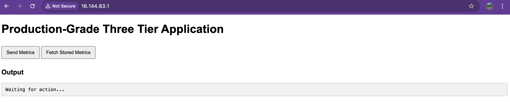
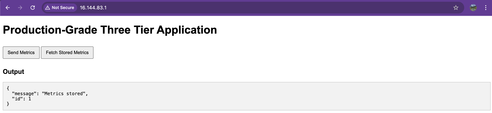
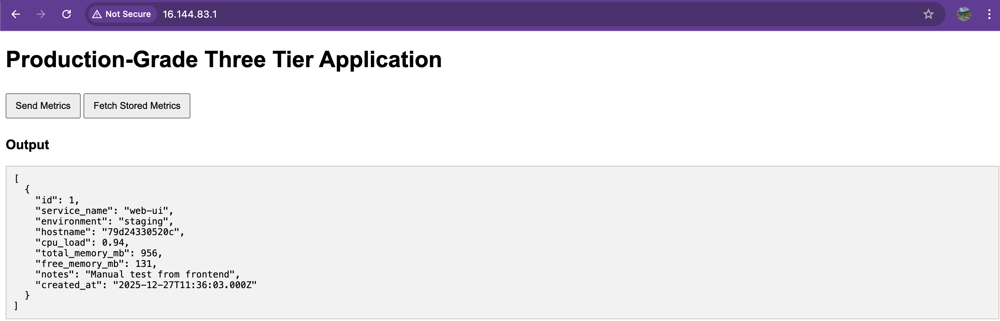
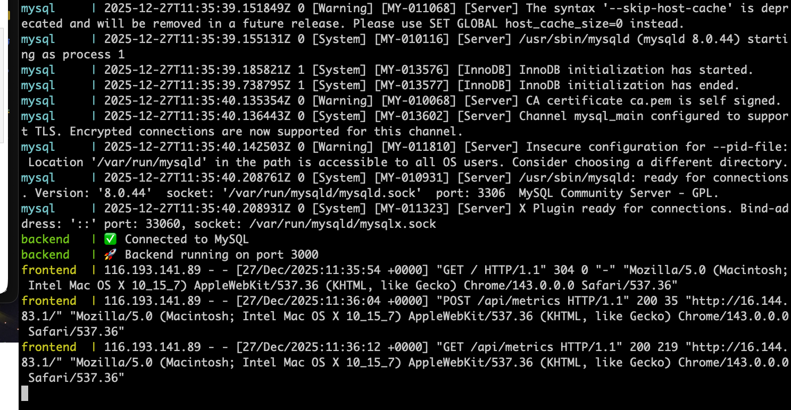
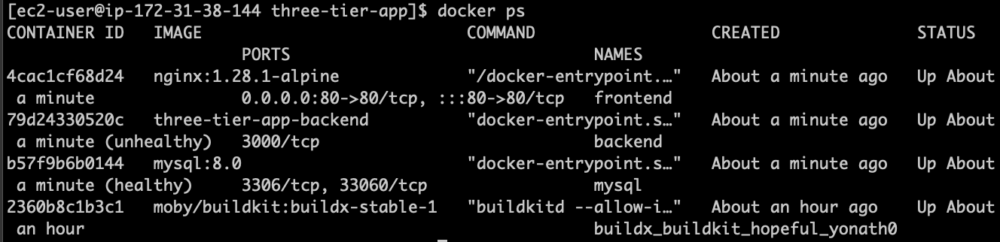

# Production-Grade Three-Tier Application (Docker & Docker Compose)

A **production-style three-tier application** built using **Docker and Docker Compose**, demonstrating a real-world setup with a frontend reverse proxy, backend API, and persistent database.  
The application collects **system metrics with user-defined metadata**, stores them in **MySQL**, and exposes REST APIs to retrieve the data.


---

## 🏗️ Architecture Overview

## ScreenShots
 <br>
 <br>
 <br>
 <br>
 <br>
---------------------------------------------------

## 🏗️ Architecture Overview

```bash 

Client (Browser)
|
v
+-------------+
| Nginx | ← Frontend (Reverse Proxy + Static UI)
+-------------+
|
v
+-------------+
| Node.js | ← Backend API (Metrics Ingestion)
+-------------+
|
v
+-------------+
| MySQL | ← Persistent Database (Docker Volume)
+-------------+


---

## 📦 Tech Stack

| Layer | Technology |
|-----|-----------|
| Frontend | Nginx (Alpine) |
| Backend | Node.js 20 (Express) |
| Database | MySQL 8.0 |
| Runtime | Docker |
| Orchestration | Docker Compose v2 |
| Storage | Docker Named Volumes |

---

## 📁 Project Structure


three-tier-app/
├── docker-compose.yml
├── .env # Not committed (secrets)
├── frontend/
│ ├── index.html
│ └── nginx.conf
├── backend/
│ ├── app.js
│ ├── package.json
│ └── Dockerfile
└── db/
└── init.sql


---

## ⚙️ Key Features & Best Practices

- ✅ Three-tier architecture (Frontend / Backend / Database)
- ✅ Nginx reverse proxy for API routing
- ✅ REST APIs with JSON input/output
- ✅ System metrics collection (CPU, memory, hostname)
- ✅ User-defined metadata persisted in MySQL
- ✅ Docker named volumes for persistent storage
- ✅ Database connection retry logic
- ✅ Health checks and resilient startup handling
- ✅ Docker Compose v2 compatible
- ✅ Production-ready logging and networking

---

## 🚀 Getting Started

### 🔧 Prerequisites (Amazon Linux 2023)

```bash
sudo dnf update -y
sudo dnf install docker -y
sudo systemctl enable --now docker
sudo usermod -aG docker ec2-user
newgrp docker


Verify:

docker --version
docker ps

Install Docker Compose v2
mkdir -p ~/.docker/cli-plugins
curl -SL https://github.com/docker/compose/releases/download/v2.27.0/docker-compose-linux-x86_64 \
  -o ~/.docker/cli-plugins/docker-compose
chmod +x ~/.docker/cli-plugins/docker-compose
docker compose version

Install Docker Buildx
curl -SL https://github.com/docker/buildx/releases/download/v0.17.1/buildx-v0.17.1.linux-amd64 \
  -o ~/.docker/cli-plugins/docker-buildx
chmod +x ~/.docker/cli-plugins/docker-buildx
docker buildx create --use
docker buildx inspect --bootstrap

⚙️ Configuration

Create a .env file (not committed to Git):

MYSQL_ROOT_PASSWORD=yourpassword
MYSQL_DATABASE=appdb

DB_HOST=mysql
DB_USER=root
DB_PASSWORD=yourpassword
DB_NAME=appdb

🏗️ Build Backend Image (Manual)

If not using buildx inside Compose:

cd backend
docker build -t three-tier-app-backend .
cd ..


Update docker-compose.yml:

backend:
  image: three-tier-app-backend

▶️ Start the Stack
docker compose up -d

🔍 Verify Services
docker compose ps
docker compose logs -f


Access:

🌐 Frontend: http://<ec2-public-ip>

🔌 API: http://<ec2-public-ip>/api/metrics

🔌 API Endpoints
➤ Insert system metrics

POST /api/metrics

{
  "service_name": "web-ui",
  "environment": "staging",
  "notes": "Manual test from frontend"
}

➤ Fetch stored metrics

GET /api/metrics

Returns all stored records ordered by time.

🗄️ Data Persistence

MySQL data is stored using a Docker named volume

Host location:

/var/lib/docker/volumes/mysql-data/_data


Data persists across container restarts and upgrades

🧠 Common Production Challenges Solved
Database initialization race condition

MySQL initializes in multiple phases

Backend uses retry logic before accepting traffic

Prevents application crashes on startup

Docker Compose schema lifecycle

Init SQL runs only on first volume creation

Volume lifecycle managed explicitly for schema changes

Reverse proxy API routing

Fixed Nginx misrouting where API calls returned HTML instead of JSON

🧪 Useful Commands
docker compose up -d
docker compose down
docker compose logs backend
docker compose logs mysql
docker volume inspect mysql-data